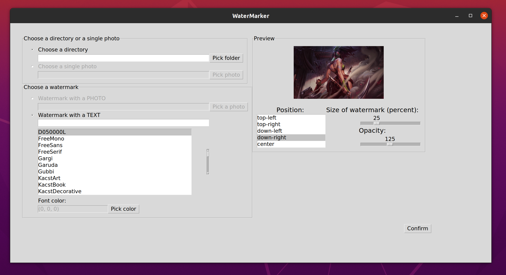

# Watermarker

## 1. What it is?

This app is made for add watermark on your image / images.

## 2. How to use it?



Let's talk about frames on the screen:

1. Choose a directory or a single photo <br> Here we can decide to set watermark on single photo or all photos in directory.

2. Choose a watermark <br> First we decide to use text or photo watermark. If photo - we have to pick it from our drive, if we want to set text we need to set it up - type the text, pick font and color of watermark.

3. Preview <br> Here we can see how our photo will looks like with choosen watermark (work in progress).

4. Position <br> Pick a position of watermark.

5. Size and opacity <br> Nothing to explain :)

## Watermarked images

1. Text watermark <br> 

2. Photo watermark <br> 

## How to install

1. Clone the repository
2. Type commands
```
poetry install
poetry run python main.py
```
